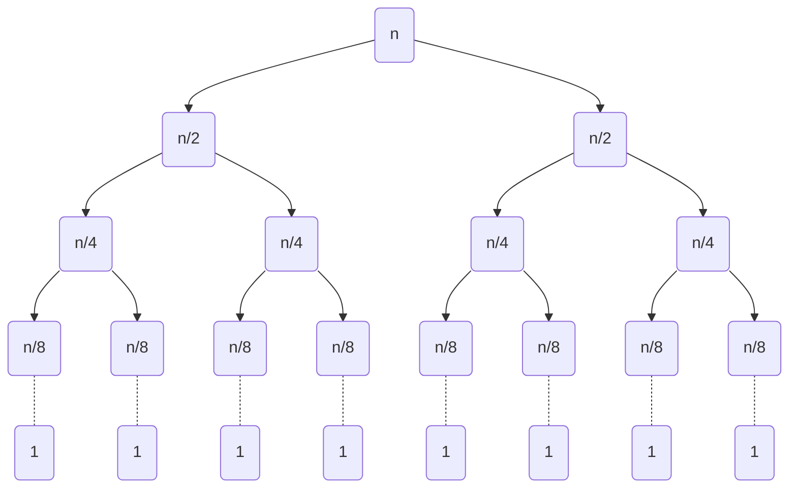
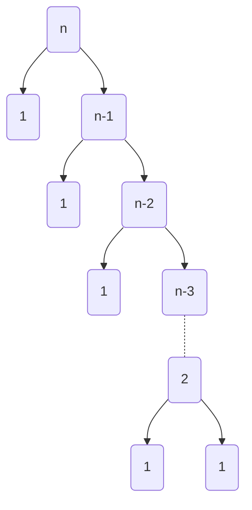

# `Binary Exponential of two numbers`
___
## If the size of (p < M)

```c++
#define M  1000000007;
int  binary_exp(int a, int p) {
        ll ans = 1;
        while (p) {
                if (p & 1 == 1) {
                        ans = ( ans * a) % M;
                }
                a = (a * a) % M;
                p = p >> 1;
        }
        return ans;
}
```
#### Time complexity of binary expo is log(p)
## If the size of (p > M)
### If M is not a prime then -
$$a^p\\%M = a^{b\\%\phi(M)}$$

if we have given $a^{b^{c}}$ ans said to calculate its value then -

### If M is a prime then_
$a^p\\%M = a^{b\\%\phi(M)}$

$a^p\\%M = a^{b\\%(M-1)}\\%M$

Here $\phi(M)=\(M-1)$,Because Euler totient function of a prime number is $\phi(M)=M*(1-\frac{1}{M})=(M-1)$
```c++
int  binary_exp(ll a, ll p, ll m) {
        ll ans = 1;
        while (p) {
                if (p & 1 == 1) {
                        ans = ( ans * a) % m;
                }
                a = (a * a) % m;
                p = p >> 1;
        }
        return ans;
}

void solve() {
        ll a, b, c;
        cin >> a >> b >> c;;
        cout<<binary_exp(a, binary_exp(b, c, M - 1),M);

}
```


# `ExtendedEuclidean Algorithm`
___
```c++
int egcd(int a, int b, int &x, int &y) {
        if (b == 0) {
                x = 1, y = 0;
                return a;
        }
        int x1, y1;
        int d = egcd(b, a % b, x1, y1);
        y = x1 - (a / b) * y1;
        x = y1;
        return d;
}
void solve() {
        int a, b, x, y;
        cin >> a >> b;
        cout<<egcd(a, b, x, y);
}

```
# `Modular Multiplicative Inverse`
___
### Finding the Modular Inverse using Extended Euclidean algorithm
```c++
void MMI(int a) {
	int x, y;
	int g = extended_euclidean(a, M, x, y);
	if (g != 1) {
		cout << "No solution!";
	}
	else {
		x = (x % M + M) % M;
		cout << x << endl;
	}
}
void solve() {
	int a;
	cin >> a;
	MMI(a);
}
```
### Finding the Modular Inverse using Binary Exponentiation
Another method for finding modular inverse is to use Euler's theorem, which states that the following congruence is true if  a and M are relatively prime:
```c++
void MMI(int a) {
	cout << binary_exp(a, M - 2) << endl;
}
void solve() {
	int a;
	cin >> a;
	MMI(a);
}
```
# `Euler's totient function`
Euler's totient function, also known as phi-function $\phi(n)$ , counts the number of integers between 1 and  n  inclusive, which are coprime to  n. 
[click here]([https://pages.github.com/](https://cp-algorithms.com/algebra/phi-function.html)).
For more information [*Click here*](https://cp-algorithms.com/algebra/phi-function.html).
```c++


ll phi_fun(ll n) {
        vector<ll>prime_factors;
        ll ans = n, i;
        for (i = 2; i * i <= n; i++) {
                if (n % i == 0) {
                        while (n % i == 0) {
                                n /= i;
                        }
                        prime_factors.push_back(i);
                }
        }
        if (n > 1) {
                prime_factors.push_back(n);
        }
        for (auto p : prime_factors) {
                ans *= (p - 1);
                ans /= p;
        }
        return ans;
}
void solve() {
        ll n;
        cin >> n;
        cout << phi_fun(n);

}
```
#### Time complexity is O(nloglog(n)).
# `Floyd Warshall Algorithm`
___
```c++
#include <bits/stdc++.h>
#define P_INF    2e16
#define ll long long
using namespace std;

ll dis[10000][10000];

void solve() {
       ll nodes , edges;
       cin >> nodes >> edges;
       for (int i = 0; i <= nodes; i++) {
              for (int j = 0; j <= nodes; j++) {
                     if (i == j) dis[i][j] = 0;
                     else  dis[i][j] = P_INF;
              }
       }
       for (int i = 0; i < edges; i++) {
              ll x, y, wt;
              cin >> x >> y >> wt;
              dis[x][y] = wt;
       }
       for (int k = 1; k <= nodes; k++) {
              for (int i = 1; i <= nodes; i++) {
                     for (int j = 1; j <= nodes; j++) {
                            dis[i][j] = min(dis[i][j], dis[i][k] + dis[k][j]);
                     }
              }
       }
       for (int i = 1; i <= nodes; i++) {
              for (int j = 1; j <= nodes; j++) {
                     if(dis[i][j]>=P_INF) cout<<"I ";
                      else cout << dis[i][j] << " ";
              }
              cout << endl;
       }

}

```
<!-- hello -->
#### Complexity of the algo is O(n^3)


# `Bellman Ford Algorithm`
___

| source       | destination           | cost  |
| ------------- |:-------------:| -----:|
| 0      |1 | -1 |
| 0      | 2      |  4 |
| 1 | 2      |    3 |
| 1      |3 | 2 |
| 1      | 4      |  2 |
| 3 | 2      |    5 |
| 3 | 1      |    1 |
| 4 | 3      |    -3 |

```c++
#include <bits/stdc++.h>
#define P_INF    2e16
#define ll long long
using namespace std;

struct edge {
       ll src, dest, wt;
};
ll V, E;

void bellmanFord(vector<edge>&graph) {
       ll distance[V];
       for (ll i = 0; i < V; i++) {
              distance[i] = P_INF;
       }
       distance[0] = 0;
       bool flag=false;
       for (ll i = 0; i < V - 1; i++) {
              flag=false;
              for (ll j = 0; j < E; j++) {
                     ll src, dest, wt;
                     src = graph[j].src;
                     dest = graph[j].dest;
                     wt = graph[j].wt;
                     if ( distance[src]!=P_INF && distance[dest] > distance[src] + wt) {
                            distance[dest] = distance[src] + wt;
                            flag=true;
                     }
              }
              if(!flag){
                     break;
              }
       }
       for(int i=0;i<V;i++){
              cout<<distance[i]<<" ";
       }
}

void solve() {
       vector<edge>graph(1000);
       cin >> V >> E;
       ll src, dest, wt;
       for (ll i = 0; i < E; i++) {
              cin >> src >> dest >> wt;
              graph[i].src = src;
              graph[i].dest = dest;
              graph[i].wt = wt;

       }
       bellmanFord(graph);
}
```
   .    | 0           | 1  | 2  | 3  | 4  |
| ------------- |:-------------:| -----:|:-------------:|:-------------:|:-------------:|
|cost| 0      |-1 | 2 | -2 | 1 | 
### Time complexity is  O(V*E)
#### For showing the path
```c++
#include <bits/stdc++.h>
#define P_INF    2e16
#define ll long long
using namespace std;

struct edge {
       ll src, dest, wt;
};
ll V, E;

void bellmanFord(vector<edge>&graph) {
       ll distance[V];
       ll parent[V];
       parent[0]=-1;
       for (ll i = 0; i < V; i++) {
              distance[i] = P_INF;
       } 
       distance[0] = 0;
       bool flag=false;
       for (ll i = 0; i < V - 1; i++) {
              flag=false;
              for (ll j = 0; j < E; j++) {
                     ll src, dest, wt;
                     src = graph[j].src;
                     dest = graph[j].dest;
                     wt = graph[j].wt;
                     if ( distance[src]!=P_INF && distance[dest] > distance[src] + wt) {
                            distance[dest] = distance[src] + wt;
                            parent[dest]=src;
                            
                            flag=true;
                     }
              }
              if(!flag){
                     break;
              }
       }
       for(int i=0;i<V;i++){
              cout<<distance[i]<<" ";
       }
       cout<<endl;
       vector<ll>path;
       for(int i=0;i<V;i++){
           int u=i;
           cout<<"From "<<i<<" : ";
           path.push_back(u);
           while(parent[u]!=-1){
               path.push_back(parent[u]);
               u=parent[u];
           }
           //reverse the path cause  the path stored in reverse order
           reverse(path.begin(),path.end());
           for(auto it : path){
               cout<<it<<" ";
           }
           path.clear();
           cout<<endl;
       }
} 
```
   Src    | Destination           | Path |
| ------------- |:-------------:| -----:|
| 0 | 0 | `0`| 
| 0 | 1 | `0->1`| 
| 0 | 2 | `0->1->2` | 
| 0 | 3 | `0->1->4->3`| 
| 0 | 4 | `0->1->4`| 
# `Segmented Seive`
```c++

#include <bits/stdc++.h>
using namespace std;
#define ll long long


void solve() {
        ll N = sqrt(1e10);
        bool prime[N];
        memset(prime, true, sizeof(prime));
        for (int i = 2; i * i <= N; i++) {
                if (prime[i]) {
                        for (int j = i * i; j <= N; j += i) {
                                prime[j] = false;
                        }
                }
        }
        vector<ll>primes;
        primes.push_back(2);
        for (int i = 3; i <= N; i += 2) {
                if (prime[i]) {
                        primes.push_back(i);
                }
        }
        ll t;
        cin >> t;
        while (t--) {
                ll l , r;
                cin >> l >> r;
                bool isPrime[r - l + 1];
                memset(isPrime, true, sizeof(isPrime));
                for (int i = 0; primes[i]*primes[i] <= r; i++) {
                        ll currentPrime = primes[i];
                        ll base = (l / currentPrime) * currentPrime;
                        if (base < l) {
                                base += currentPrime;
                        }
                        for (int j = base; j <= r ; j += currentPrime) {
                                isPrime[j - l] = false;
                                if (base == currentPrime) {
                                        isPrime[base - l] = true;
                                }
                        }
                }
                for (int i = 0; i < r - l + 1; i++) {
                        if (isPrime[i]) {
                                if (l + i != 1) {
                                        cout << l + i << endl;
                                }
                        }
                }
                cout << endl;
        }
}

int main()
{
        solve();
        return 0;
}
```
$\large Complexity\space is\space O(n)\space .$
# Counting sort
```c++
void countSort(int array[], int size) {
    int output[MAX];
    int count[MAX];
    int max = array[0];

    // Here we find the largest item in the array
    for (int i = 1; i < size; i++) { if (array[i] > max)
            max = array[i];
    }

    // Initialize the count for each element in array to 0
    for (int i = 0; i <= max; ++i) {
        count[i] = 0;
    }

    // For each element we store the count
    for (int i = 0; i < size; i++) {
        count[array[i]]++;
    }

    // Store the cummulative count of each array
    for (int i = 1; i <= max; i++)
	{
		count[i] += count[i - 1];
	}
	
	// Search the index of each element of the actual array in count array, and
	// place the elements in output array
	for (int i = size - 1; i >= 0; i--) 
    {
        output[count[array[i]] - 1] = array[i];
        count[array[i]]--;
    }

    // Transfer the sorted items into actual array
    for (int i = 0; i < size; i++) {
        array[i] = output[i];
    }
}
```
$\textrm{\Large Lets say , we have an array A =[1,2,4,3,0,1,7,1,4,3,0].  Sort this using counting sort .}$
|  $\large index$  |  $0$   | $1$ | $2$ | $3$| $4$ | $5$| $6$ |$7$ |$8$ |$9$ |$10$ |$11$ |
| ------------- |:-------------:|:-------------:|:-------------:|:-------------:|:-------------:|:-------------:|:-------------:|:-------------:|:-------------:|:-------------:|:-------------:| -----:| 
| $\large A$ | $1$ | $2$ | $4$ | $3$ | $0$ | $2$ | $1$ |$7$ |$1$ |$4$ |$3$ |$0$ |

$\textrm{\large count[A[i]]++}$

|  $\large index$  |  $0$   | $1$ | $2$ | $3$| $4$ | $5$| $6$ |$7$ |
| ------------- |:-------------:|:-------------:|:-------------:|:-------------:|:-------------:|:-------------:|:-------------:|-----:| 
| $\textrm{\large count}$ | $2$ | $3$ | $2$ | $2$ | $2$ | $0$ | $0$ |$1$ |

$\textrm{\large count[i] += count[i - 1]}$

|  $\large index$  |  $0$   | $1$ | $2$ | $3$| $4$ | $5$| $6$ |$7$ |
| ------------- |:-------------:|:-------------:|:-------------:|:-------------:|:-------------:|:-------------:|:-------------:|-----:| 
| $\textrm{\large count}$ | $2$ | $5$ | $7$ | $9$ | $11$ | $11$ | $11$ |$12$ |

$\textrm{\large output[count[A[i]] - 1] = A[i]}$

$\textrm{\large count[A[i]]--}$
	
|  $\large index$  |  $0$   | $1$ | $2$ | $3$| $4$ | $5$| $6$ |$7$ |$8$ |$9$ |$10$ |$11$ |
| ------------- |:-------------:|:-------------:|:-------------:|:-------------:|:-------------:|:-------------:|:-------------:|:-------------:|:-------------:|:-------------:|:-------------:| -----:| 
| $\textrm{\large output}$ | $0$ | $0$ | $1$ | $1$ | $1$ | $2$ | $2$ |$3$ |$3$ |$4$ |$4$ |$7$ |

### Complexity is O(n)
# Merge sort
```C++
void merge(int a[], int lb, int mid, int ub)
{
  int i = lb;
  int j = mid + 1;
  int k = 0;
  int b[20], m, n;
  while (i <= mid && j <= ub)
  {
    if (a[i] <= a[j])
    {
      b[k] = a[i];
      i++; k++;
    }
    else
    {
      b[k] = a[j];
      j++; k++;
    }
  }// end of while loop
  if (i > mid)
  {
    while (j <= ub)
    {
      b[k] = a[j];
      j++; k++;
    }
  }
  else
  {
    while (i <= mid)
    {
      b[k] = a[i];
      k++; i++;
    }
  }
  for (i = lb; i <= ub; i++)
  {
    a[i] = b[i - lb];
  }
}
```
```C++
void mergeshort(int a[], int lb, int ub)
{
  if (lb < ub)
  {
    int mid = (lb + ub) / 2;
    mergeshort(a, lb, mid);
    mergeshort(a, mid + 1, ub);
    merge(a, lb, mid, ub);
  }
}
```

### Time Complexity analysis
```math
\large
\begin{aligned} 
T(n) &=2T(\frac{n}{2})+n \\
       &=2[2T(\frac{n}{4})+ \frac{n}{2}]+n \\
       &=2^2T(\frac{n}{4})+ n+n=2^2T(\frac{n}{2^2})+2n \\
       &=2^2[2T(\frac{n}{8})+ \frac{n}{4}]+2n=2^3T(\frac{n}{2^3})+n+2n=2^3T(\frac{n}{2^3})+3n \\
       &=\cdots \\
       &=2^kT(\frac{n}{2^k})+nk \\
       
       Assume,\space\space\space T(\frac{n}{2^k})=T(1)\\
       \frac{n}{2^k}=1 \\
       n=2^k \\
       k=log_2 n\\
       So, 
       T(n)&=2^{log_2 n}T(1)+nlog_2 n \\
        &=n*1+nlog_2n \\
	&=n+nlog_2 n \\
	So\space the\space time\space comlexity\space is\space O(nlog_2 n)
\end{aligned} 
```

# Quick Sort
```C++
void quickshort(char list[],int low ,int high)
{
    int pivot,temp,i,j;
    if(low<high)
    {
        pivot=low;
        i=low;
        j=high;
        while(i<j)
        {
            while(list[i]<=list[pivot] && i<=high)
            {
                i++;
            }
            while(list[j]>list[pivot] && j>=low)
            {
                j--;
            }
            if(i<j)
            {
                temp=list[i];
                list[i]=list[j];
                list[j]=temp;
            }
        }
        temp=list[j];
        list[j]=list[pivot];
        list[pivot]=temp;
        quickshort(list,low,j-1);
        quickshort(list,j+1,high);
    }
}
```
### Time complexity anaysis
#### For Best case-
 $\Large \textbf Just \space like \space the\space merge\space sort\space .$
 $\Large Average\space and\space best\space case\space time\space complexity\space is\space O(n*logn)\space $
#### For worst case-

```math
\large
\begin{aligned} 
T(n) &=T(n-1)+n \\
     &=T(n-2)+(n-1)+n \\
     &=T(n-3)+(n-2)+(n-1)+n \\
     &=\cdots \\
     &=T(n-k-1)+(n-k)+\cdots +(n-2)+(n-1)+n \\
     
  Assume , n-k-1=1 \\
           k=n-2 \\
	   So,\\
	   T(n)&=T(n-(n-2)-1)+(n-(n-2))+\cdots +(n-2)+(n-1)+n \\
	   &=1+2+3+\cdots +(n-2)+(n-1)+n \\
	   &=\frac{n(n+1)}{2} \\ \\
	   T(n)&=O(n^2) \\
      
\end{aligned} 
```
$\Large worst\space case\space time\space complexity\space is\space O(n^2)\space $
# dynamic programming
### Fibonacci series
```C++
ll mem[10000];
ll fib(int n) {
     if(mem[n]!=-1) return mem[n];
     if (n == 0)   return 0;
     if (n == 1 || n == 2)  return 1;
     return mem[n] = fib(n - 1) + fib(n - 2);
}

void solve() {
     memset(mem, -1, sizeof(mem));
     ll n;
     cin >> n;
     cout << fib(n - 1) + fib(n - 2) << endl;
}
```
$Time\space complexity\space of\space the\space series\space is\space O(n)\space$
## 0-1 Knapsack
```C++
ll wt[110], val[N];
ll dp[110][N];
ll Knapsack(ll indx, ll wt_left) {
        if (wt_left == 0) {
                return 0;
        }
        if (indx < 0) {
                return 0;
        }
        if (dp[indx][wt_left] != -1) {
                return dp[indx][wt_left];
        }
        // function calling when wt[indx] is avoided//
        ll ans = Knapsack(indx - 1, wt_left - 0);
        //function calling when wt[indx] is considered//
        if (wt_left - wt[indx] >= 0) {
                ans = max(ans, Knapsack(indx - 1, wt_left - wt[indx]) + val[indx]);
        }
        return dp[indx][wt_left] = ans;
}
void solve() {
        memset(dp, -1, sizeof(dp));
        ll n, w;
        cin >> n >> w;
        for (int i = 0; i < n; i++) {
                cin >> wt[i] >> val[i];
        }
        cout << Knapsack(n - 1, w) << endl;
}
```
$Time\space complexity\space of\space the\space series\space is\space O(n)\space$
## Longest common subsequence(LCS)
### Top-down approach-
```C++
int lcs(char* X, char* Y, int i, int j,vector<vector<int> >& dp)
{
    if (i == 0 || j == 0)
        return 0;
    if (X[i - 1] == Y[j - 1])
        return dp[i][j] = 1 + lcs(X, Y, i - 1, j - 1, dp);
  
    if (dp[i][j] != -1) {
        return dp[i][j];
    }
    return dp[i][j] = max(lcs(X, Y, i, j - 1, dp),
                          lcs(X, Y, i - 1, j, dp));
}
```
### Bottom-up approach-
```C++
void solve() {
     ll n, m;
     cin >> n >> m;
     ll dp[n][m];
     memset(dp, 0, sizeof(dp));
     string str1, str2;
     cin >> str1 >> str2;
     for (int i = 1; i <= n; i++) {
          for (int j = 1; j <= m; j++) {
               if (str1[i - 1] == str2[j - 1]) {
                    dp[i][j] = 1 + dp[i - 1][j - 1];
               }
               else {
                    dp[i][j] = max(dp[i - 1][j], dp[i][j - 1]);
               }
          }
     }
     cout << dp[n][m] << endl;

}
```
$\large Time\space complexity\space of\space the\space series\space is\space O(n^2)\space$

 Assume we shave two string 
 ```math
\begin{aligned} 
 S1&=ABCDGH \\
 S2&=AEDFHR
 \end{aligned} 
```
 
|  index  |  $0$   | $1$```A``` | $2$```E``` | $3$```D``` | $4$```F``` | $5$```H``` | $6$```R``` |
| ------------- |:-------------:|:-------------:|:-------------:|:-------------:|:-------------:|:-------------:| -----:| 
| $0$ | $0$ | $0$ | $0$ | $0$ | $0$ | $0$ | $0$ |
| $1$```A``` | $0$ | $1$ | $1$ | $1$ | $1$ | $1$ | $1$ |
| $2$```B``` | $0$ | $1$ | $1$ | $1$ | $1$ | $1$ | $1$ |
| $3$```C``` | $0$ | $1$ | $1$ | $1$ | $1$ | $1$ | $1$ |
| $4$```D``` | $0$ | $1$ | $1$ | $2$ | $2$ | $2$ | $2$ |
| $5$```G``` | $0$ | $1$ | $1$ | $2$ | $2$ | $2$ | $2$ |
| $6$```H``` | $0$ | $1$ | $1$ | $2$ | $2$ | $3$ | $3$ |

So the longest LCS length is 3.

