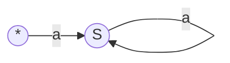
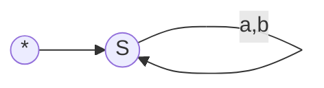

## Contex Free Grammar (CFG)
$\textrm{\large Definition : A CFG is a set of rules/productions used to generate patterns of strings.}$
```math
\begin{align*}
L &=\{ \text{Strings containing 0 and 1 \}} \\
  &= \{01,001,010,011,100,\cdots \} \\
  \end{align*} 
```
$\textrm{Lets say we have a language}$ 
```math
\begin{align*}
L=\{0^n1^n | n\geq 1\} \\
if\space\space n=1\space ;\space 0^11^1 \\
if\space\space n=2\space ;\space 0^21^2\space  =\space 0011 \\
if\space\space n=3\space ;\space 0^31^3\space =\space 000111 \\
\end{align*} 
```
$\textrm{So the CFG of the language is A}\rightarrow \textrm{01 |0A1} \space\space or\space\space \textrm{A}\rightarrow \textrm{01 and  A }\rightarrow\textrm{0A1}$

$\textrm{Question : Form the sequence [000111] by the grammer} \cdots$

```math
\begin{align*}
&A\rightarrow 0A1 \\
&A\rightarrow 00A11 \\
&A\rightarrow 000A111 \\
\end{align*} 
```
$\textrm{\large Formal Definition : A contex free grammer is a 4-typles (V,T,R,S)}$

$\textrm{1. V} \rightarrow \textrm{Variable , N} \rightarrow \textrm{ Nonterminal}$

$\textrm{2. T}\rightarrow \textrm{Terminal , }\large \Sigma$

$\textrm{3. R}\rightarrow \textrm{Rules , p} \rightarrow \textrm{ Production}$

$\textrm{4. S}\rightarrow \textrm{Starting Variable , } S\in V$

$\textrm{\large Example : From the given CFG , determine the variable ,Terminal and starting variables.}$

```math
\begin{align*}
A &\rightarrow \ 01|0A1 \\
A &\rightarrow \ 0A1 \\
A &\rightarrow \ 01 \\
B &\rightarrow \ \# \\
 \end{align*} 
```

```math
\begin{align*}
Variable &=\{ \text{A,B \}} \\
Terminal &= \{0,1,\# \} \\
Starting Variable &= \{A\} \\
  \end{align*} 
```
$\textrm{\large Identify the terminal, non-terminals, start variable from given CFG :}$

```math
\begin{align*}
(1)E &\rightarrow E+T|T   \space \space \space \space \space \space \space \space \space \space \space \space \space \space \space \space \space \space \space \space \space \space \space \space \space \space \space      &(2) S &\rightarrow (L)|a               \\
T &\rightarrow T*F|F          &  L &\rightarrow L,S|S    & \\
F &\rightarrow (E) | id   &  Ans: \textrm{Nonnterminal}&=\{ \text{S,L\}} \\
Ans:\textrm{ Nonnterminal}&=\{ \text{E,T,F \}}  & \textrm{Terminal}&=\{ \textrm{'(',')',',' \}}\\
\textrm{Terminal}&=\{ \textrm{'+' , '*'  ,  '(',')','id' \}}  & \textrm{startveriable}&=\{ \textrm{'S'\}}\\
\textrm{startveriable}&=\{ \textrm{'E'\}}
\end{align*}
```

$\textrm{\large Desiginging Contex-free language :}$

```math
\begin{align*}
(1)L &=\{a^n | n \ \ge 0 \} \\
  &= \{\epsilon,a,aa,aaa,\cdots \} \\
  \end{align*} 
```


$\textrm{\large CFG = S}\rightarrow \textrm{\large Sa|}\Large\epsilon$

$\text{Example: Generate = aaa}$

$\text{S}\rightarrow \textrm{aS} \rightarrow \textrm{aaS} \rightarrow \textrm{aaaS}\rightarrow \textrm{aaa} $


```math
\begin{align*}
(2)L &=\{a^n | n \ \ge 1 \} \\
  &= \{a,aa,aaa,aaaa,\cdots \} \\
  \end{align*} 
```


$\textrm{\large CFG = S}\rightarrow \textrm{\large Sa|}\Large\epsilon$

$\text{Example: Generate = aaa}$

$\text{S}\rightarrow \textrm{aS} \rightarrow \textrm{aaS} \rightarrow \textrm{aaa}$


```math
\begin{align*}
(3)L &=\{set of all strings over a and b \} \\
  &= \{\epsilon,a,b,aa,ab,bb,aaa,aba\cdots \} \\
  \end{align*} 
```

$\textrm{\large NFA/DFA = (aUb)}^* \textrm{\large     or   (a+b)}^* \textrm{\large    or (a|b)}^*$

$\textrm{\large CFG = S}\rightarrow \textrm{\large aS|}\textrm{\large bS|}\Large\epsilon$

$\text{Example: Generate = aab}$

$\text{S}\rightarrow \textrm{aS} \rightarrow \textrm{aaS} \rightarrow \textrm{aabS}\rightarrow \textrm{aab}$


```math
\begin{align*}
(4)L &=\textrm{\large Construct a CFG for set of all strings which length at least 2.} \\
  \Large\epsilon &= \{a,b \} \\
  &= \{aa,ab,bb,aaa,aba,aaa,bab\cdots \} \\
  \end{align*} 
```

$\textrm{\large CFG = S}\rightarrow \textrm{\large A}\textrm{\large A}\textrm{\large B}$

$\textrm{\large  A}\rightarrow \textrm{\large a|}\textrm{\large b}$

$\textrm{\large  B}\rightarrow \textrm{\large aB|}\textrm{\large bB|}\Large\epsilon$

$\text{Example: Generate = bbb}$

$\text{S}\rightarrow \textrm{AAB} \rightarrow \textrm{bAB} \rightarrow \textrm{bbB}\rightarrow \textrm{bbbB}\rightarrow \textrm{bbb}$


```math
\begin{align*}
(5)L &=\textrm{\large Construct a CFG for set of all strings which at least three 0's} \\
  \Large\epsilon &= \{0,1 \} \\
  &= \{10101,0000,100101,00000,\cdots \} \\
  \end{align*} 
```

$\textrm{\large CFG = S}\rightarrow \textrm{\large A0A0A0A}$

$\textrm{\large  A}\rightarrow \textrm{\large 0A|}\textrm{\large 1A|}\Large\epsilon$

$\text{Example: Generate = 110010}$

$\text{S}\rightarrow \textrm{A0A0A0A} \rightarrow \textrm{1A0A0A0A} \rightarrow \textrm{11A0A0A0A}\rightarrow \textrm{A0A0A0A}\rightarrow \textrm{bbb}$

## Contex Free Grammar (CFG)
$\textrm{\large Definition : A CFG is a set of rules/productions used to generate patterns of strings.}$
```math
\begin{align*}
L &=\{ \text{Strings containing 0 and 1 \}} \\
  &= \{01,001,010,011,100,\cdots \} \\
  \end{align*} 
```
$\textrm{Lets say we have a language}$ 
```math
\begin{align*}
L=\{0^n1^n | n\geq 1\} \\
if\space\space n=1\space ;\space 0^11^1 \\
if\space\space n=2\space ;\space 0^21^2\space  =\space 0011 \\
if\space\space n=3\space ;\space 0^31^3\space =\space 000111 \\
\end{align*} 
```
$\textrm{So the CFG of the language is A}\rightarrow \textrm{01 |0A1} \space\space or\space\space \textrm{A}\rightarrow \textrm{01 and  A }\rightarrow\textrm{0A1}$

$\textrm{Question : Form the sequence [000111] by the grammer} \cdots$

```math
\begin{align*}
&A\rightarrow 0A1 \\
&A\rightarrow 00A11 \\
&A\rightarrow 000A111 \\
\end{align*} 
```
$\textrm{\large Formal Definition : A contex free grammer is a 4-typles (V,T,R,S)}$

$\textrm{1. V} \rightarrow \textrm{Variable , N} \rightarrow \textrm{ Nonterminal}$

$\textrm{2. T}\rightarrow \textrm{Terminal , }\large \Sigma$

$\textrm{3. R}\rightarrow \textrm{Rules , p} \rightarrow \textrm{ Production}$

$\textrm{4. S}\rightarrow \textrm{Starting Variable , } S\in V$

$\textrm{\large Example : From the given CFG , determine the variable ,Terminal and starting variables.}$

```math
\begin{align*}
A &\rightarrow \ 01|0A1 \\
A &\rightarrow \ 0A1 \\
A &\rightarrow \ 01 \\
B &\rightarrow \ \# \\
 \end{align*} 
```

```math
\begin{align*}
Variable &=\{ \text{A,B \}} \\
Terminal &= \{0,1,\# \} \\
Starting Variable &= \{A\} \\
  \end{align*} 
```
$\textrm{\large Identify the terminal, non-terminals, start variable from given CFG :}$

```math
\begin{align*}
(1)E &\rightarrow E+T|T   \space \space \space \space \space \space \space \space \space \space \space \space \space \space \space \space \space \space \space \space \space \space \space \space \space \space \space      &(2) S &\rightarrow (L)|a               \\
T &\rightarrow T*F|F          &  L &\rightarrow L,S|S    & \\
F &\rightarrow (E) | id   &  Ans: \textrm{Nonnterminal}&=\{ \text{S,L\}} \\
Ans:\textrm{ Nonnterminal}&=\{ \text{E,T,F \}}  & \textrm{Terminal}&=\{ \textrm{'(',')',',' \}}\\
\textrm{Terminal}&=\{ \textrm{'+' , '*'  ,  '(',')','id' \}}  & \textrm{startveriable}&=\{ \textrm{'S'\}}\\
\textrm{startveriable}&=\{ \textrm{'E'\}}
\end{align*}
```

$\textrm{\large Desiginging Contex-free language :}$

```math
\begin{align*}
(1)L &=\{a^n | n \ \ge 0 \} \\
  &= \{\epsilon,a,aa,aaa,\cdots \} \\
  \end{align*} 
```


$\textrm{\large CFG = S}\rightarrow \textrm{\large Sa|}\Large\epsilon$

$\text{Example: Generate = aaa}$

$\text{S}\rightarrow \textrm{aS} \rightarrow \textrm{aaS} \rightarrow \textrm{aaaS}\rightarrow \textrm{aaa} $


```math
\begin{align*}
(2)L &=\{a^n | n \ \ge 1 \} \\
  &= \{a,aa,aaa,aaaa,\cdots \} \\
  \end{align*} 
```


$\textrm{\large CFG = S}\rightarrow \textrm{\large Sa|}\Large\epsilon$

$\text{Example: Generate = aaa}$

$\text{S}\rightarrow \textrm{aS} \rightarrow \textrm{aaS} \rightarrow \textrm{aaa}$


```math
\begin{align*}
(3)L &=\{set of all strings over a and b \} \\
  &= \{\epsilon,a,b,aa,ab,bb,aaa,aba\cdots \} \\
  \end{align*} 
```

$\textrm{\large NFA/DFA = (aUb)}^* \textrm{\large     or   (a+b)}^* \textrm{\large    or (a|b)}^*$

$\textrm{\large CFG = S}\rightarrow \textrm{\large aS|}\textrm{\large bS|}\Large\epsilon$

$\text{Example: Generate = aab}$

$\text{S}\rightarrow \textrm{aS} \rightarrow \textrm{aaS} \rightarrow \textrm{aabS}\rightarrow \textrm{aab}$


```math
\begin{align*}
(4)L &=\textrm{\large Construct a CFG for set of all strings which length at least 2.} \\
  \Large\epsilon &= \{a,b \} \\
  &= \{aa,ab,bb,aaa,aba,aaa,bab\cdots \} \\
  \end{align*} 
```

$\textrm{\large CFG = S}\rightarrow \textrm{\large A}\textrm{\large A}\textrm{\large B}$

$\textrm{\large  A}\rightarrow \textrm{\large a|}\textrm{\large b}$

$\textrm{\large  B}\rightarrow \textrm{\large aB|}\textrm{\large bB|}\Large\epsilon$

$\text{Example: Generate = bbb}$

$\text{S}\rightarrow \textrm{AAB} \rightarrow \textrm{bAB} \rightarrow \textrm{bbB}\rightarrow \textrm{bbbB}\rightarrow \textrm{bbb}$


```math
\begin{align*}
(5)L &=\textrm{\large Construct a CFG for set of all strings which at least three 0's} \\
  \Large\epsilon &= \{0,1 \} \\
  &= \{10101,0000,100101,00000,\cdots \} \\
  \end{align*} 
```

$\textrm{\large CFG = S}\rightarrow \textrm{\large A0A0A0A}$

$\textrm{\large  A}\rightarrow \textrm{\large 0A|}\textrm{\large 1A|}\Large\epsilon$

$\text{Example: Generate = 110010}$

$\text{S}\rightarrow \textrm{A0A0A0A} \rightarrow \textrm{1A0A0A0A} \rightarrow \textrm{11A0A0A0A}\rightarrow \textrm{A0A0A0A}\rightarrow \textrm{bbb}$


