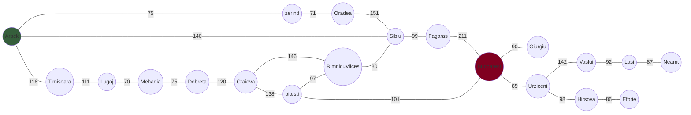

## A* search algorithm
$\textrm{\large A* search algorithm  }$[**_tutorial_**](https://www.youtube.com/watch?v=qVu0Fgde-LI)

```mermaid
flowchart LR;
1((Arack))
2((zerind))
3((Oradea))
4((Sibiu))
5((Timisoara))
6((Lugoj))
7((Mehadia))
8((Dobreta))
9((Craiova))
10((RimnicuVilces))
11((pitesti))
12((Fagaras))
13((Bucharest))
14((Giurgiu))
15((Urziceni))
16((Vaslui))
17((Lasi))
18((Neamt))
19((Hirsova))
20((Eforie))
style 1 fill:#355E3B
style 13 fill:#800020
1-- 75 ---2
2-- 71 ---3
3--151---4
1--118---5--111---6--70---7--75---8--120---9
1--140---4
9--146---10--80---4
9--138---11--97---10
4--99---12
12--211---13
11--101---13
13--90---14
13--85---15
15--142---16--92---17--87---18
15--98---19--86---20


```
