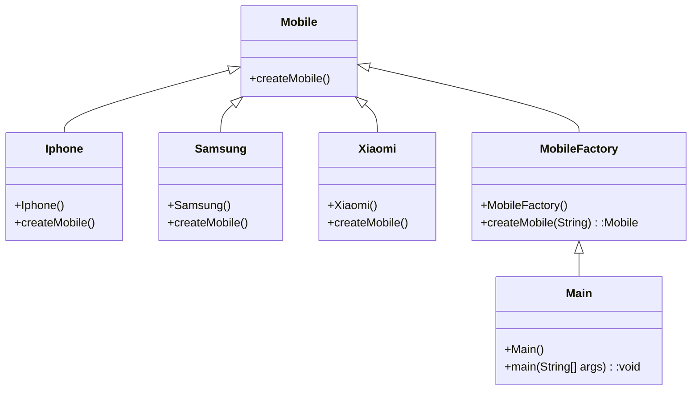

```mermaid

classDiagram
      Mobile <|-- Iphone
      Mobile <|-- Samsung
      Mobile <|-- Xiaomi
      Mobile <|-- MobileFactory
      MobileFactory<|--Main
      Mobile: +createMobile()
      
      class Iphone{
         
          +Iphone()
          +createMobile()
      }
      class Samsung{
          +Samsung()
          +createMobile()
      }
      class Xiaomi{
          +Xiaomi()
          +createMobile()
      }
      class MobileFactory{
          +MobileFactory()
          +createMobile(String):Mobile
      }
      class Main{
        +Main()
        +main(String[] args):void
      }

```