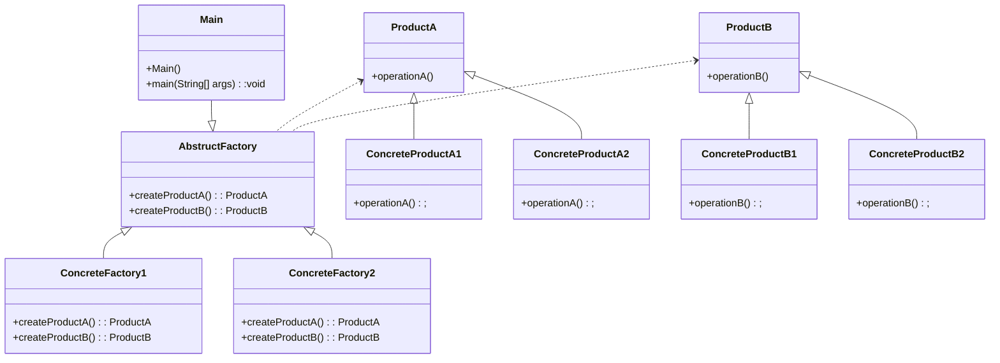

```mermaid
classDiagram
Main--|>AbstructFactory
AbstructFactory <|-- ConcreteFactory1
AbstructFactory <|-- ConcreteFactory2
ProductA <.. AbstructFactory
ProductB <.. AbstructFactory
ProductA <|-- ConcreteProductA1
ProductA <|-- ConcreteProductA2
ProductB <|-- ConcreteProductB1
ProductB <|-- ConcreteProductB2
class AbstructFactory{
+createProductA(): ProductA
+createProductB(): ProductB
}
class ConcreteFactory1{
+createProductA(): ProductA
+createProductB(): ProductB
}
class ConcreteFactory2{
+createProductA(): ProductA
+createProductB(): ProductB
}
class ProductA{
+operationA()
}
class ProductB{
+operationB()
}
class ConcreteProductA1{
+operationA();
}
class ConcreteProductA2{
+operationA();
}
class ConcreteProductB1{
+operationB();
}
class ConcreteProductB2{
+operationB();
}
class Main{
+Main()
+main(String[] args):void
}
```