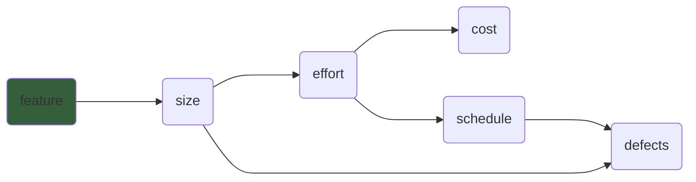

# 9/19
```C++
// this fun take a number
int foo(int a)
{
  //return square
   return a*a;
}
```

$\textrm{\large How many line are in there-(4,3,6)? All are correct.Ans are depends on the question.}$

$\textrm{\large What is measurement model?}$

$\textrm{\large =>making the unmeasureable measureable.}$

$\textrm{\large Types of model : }$
<ol>
  <li>$Text$</li>
  <li>$Diagramatic$</li>
  <li>$Algorithm.$</li>
</ol>

$\textrm{\large 1.Text: }$

$\textrm{\large Defects: Incompletenese of the product or wrong use case etc.Agile model is a text model.}$


$\textrm{\large 2.Diagramatic:}$

$\textrm{\large 3.Algorithm:}$

effort = schedule * resource
       = A*(Sizeof Program^B)+C

response time : diagram

$\textrm{\large ResponseTime = (start of decorate - end of decorate)}$

$\textrm{\large How to measure anything?}$ nije pora.

$\textrm{\Large Another model:}$

$\textrm{\large Meta model for metrics:}$

define concept(response time)-> define(how to measure time)(average response time in one hour(absatruct)) -> operational definition(clearing abstruct definition)(avaerage response time in one hour(calculation))->measurement of real world.

```mermaid
flowchart TD;

    root1{{define concept}}

    1(define)
    2(operational definition)
    3(measurement of real world)
    style root1 fill:#424949
    root1-->1-->2-->3
```



### Measurement scale

<ol>
  <li>$\textrm{\large Nominal(mode)}$ </li>
  <li>$\textrm{\large Ordinal(median)}$</li>
  <li>$\textrm{\large Interval(mode,medium,mean)}$</li>
  <li>$\textrm{\large Ratio}$</li>
  <li>$\textrm{\large Absolute}$</li>
</ol>

$\textrm{\large 1.Nominal:Unordered set of categories.}$

$\textrm{\large 2.Ordinal:Ordered set of categories.Can't compare with each other categorie.Like we cant say 2 major bug > 4 minor bug.}$

$\textrm{\large 3.Interval:If there is consistent difference, we measure it via interval.}$

$\textrm{\large 4.Ratio:}$

$\textrm{\large 5.Absolute: Number of occurance.There is no negative value.}$

#### Variability

$\textrm{\large Range:between low and high point in data.}$

$\textrm{\large Daviation:Mean -> distance.}$
```math
\begin{flalign}
\textrm{\large Range: Between low and high point in data.} \\ \\
\textrm{\large Daviation:Mean -> distance.} \\ \\
\textrm{\large Variance:} \sum_{}^{} \frac{\textrm{\large Deviations}^{2}}{\large N}  \\ \\
\textrm{\large Standard Deviation:}\sqrt{\textrm{\large Variance}} \\ \\
\textrm{\large Index of Variation:} \frac{\textrm{\large Standard Deviation}}{\large Mean} \\
\end{flalign} 
```

End of 3rd chapter


